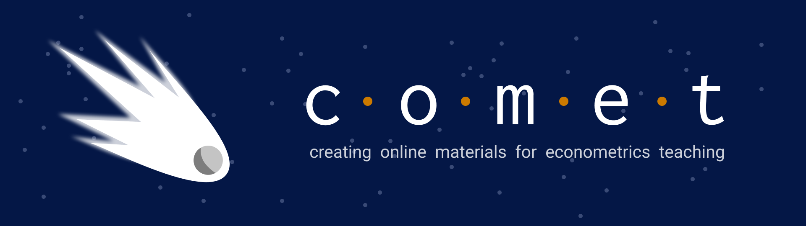

# Copyright Information

This project uses data from a variety of sources, most available under an open data license.  All other material is currently copyright © 2022 by the Comet Team.  Please do not republish without authorization

## ECON 325 Modules and Introduction Modules
​
* The **2016 Census Data** was provided under the [Statistics Canada Open License (Public)](https://www.statcan.gc.ca/en/reference/licence).  
  * Source: Statistics Canada, 2016 Census Public Use Microdata File (PUMF). Individuals File, 2019. Reproduced and distributed on an "as is" basis with the permission of Statistics Canada.
  * Adapted from Statistics Canada, 2016 Census Public Use Microdata File (PUMF). Individuals File, 2019. This does not constitute an endorsement by Statistics Canada of this product.
​

* The [**Penn World Table**](https://www.rug.nl/ggdc/productivity/pwt/?lang=en)  was provided by Feenstra, Robert C., Robert Inklaar and Marcel P. Timmer (2015), "The Next Generation of the Penn World Table" American Economic Review, 105(10), 3150-3182, available for download at www.ggdc.net/pwt
  * The Penn World Table Penn World Table 10.0 by Robert C. Feenstra, Robert Inklaar and Marcel P. Timmer is licensed under a [Creative Commons Attribution 4.0 International License](http://creativecommons.org/licenses/by/4.0/). This research received support through grants from the National Science Foundation, the Sloan Foundation and the Transatlantic Platform’s Digging into Data program.

* The **2019 Survey of Financial Security** that was used in the example notebook, was provided under the [Statistics Canada Open License (Public)](https://www.statcan.gc.ca/en/reference/licence).       
  *  Source: Statistics Canada, Survey of Financial Security, 2019, 2021. Reproduced and distributed on an "as is" basis with the permission of Statistics Canada.
  * Adapted from Statistics Canada, Survey of Financial Security, 2019, 2021. This does not constitute an endorsement by Statistics Canada of this product.

## ECON 326 Modules
​
* The **2019 Survey of Financial Security** that was used in modules one through five, was provided under the [Statistics Canada Open License (Public)](https://www.statcan.gc.ca/en/reference/licence).       
  *  Source: Statistics Canada, Survey of Financial Security, 2019, 2021. Reproduced and distributed on an "as is" basis with the permission of Statistics Canada.
  * Adapted from Statistics Canada, Survey of Financial Security, 2019, 2021. This does not constitute an endorsement by Statistics Canada of this product.